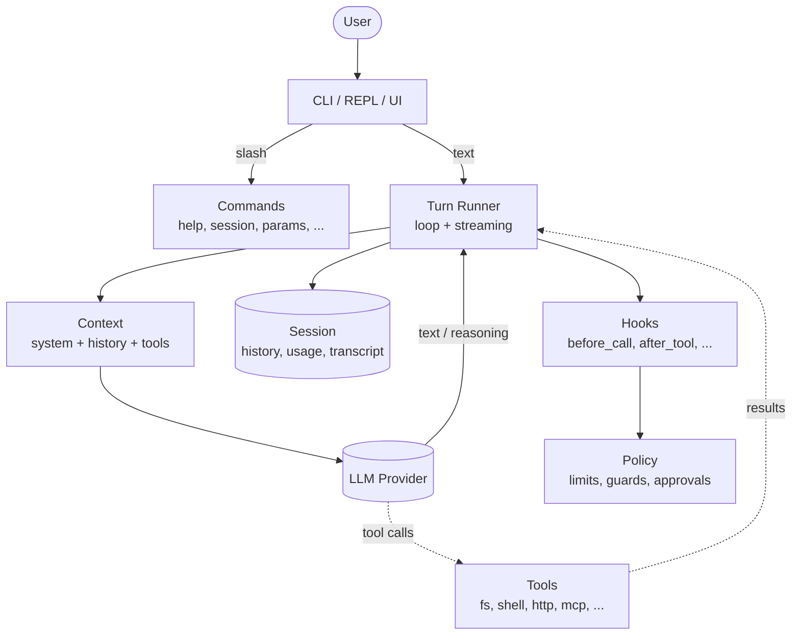
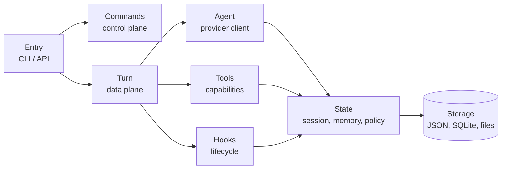

# Harness Lab

My personal study lab for **coding agent harnesses**: the code
around an LLM that turns a raw model into a useful tool -- turn
loop, history, slash commands, streaming, tools, storage,
personas, hooks, policy, orchestration.

Each experiment lives in its own app under [apps/](apps/). Some
are built from scratch, some copy ideas from other projects, some
use a framework (PydanticAI, OpenAI Agents SDK, and so on).

## What is a harness?

The model alone can only predict tokens. A harness is everything
that turns that into an agent: it reads input, builds context,
runs commands, calls tools, saves state, and keeps cost in check.



### Typical layers



## Apps

| App                          | Focus                                                        |
| ---------------------------- | ------------------------------------------------------------ |
| [apps/simple/](apps/simple/) | Tiny harness, REPL + slash commands, no framework            |
| [apps/tooled/](apps/tooled/) | Tool calls + hooks + policy + memory + multi-provider roles  |

See [apps/simple/README.md](apps/simple/README.md) and
[apps/tooled/README.md](apps/tooled/README.md) for details.

## Stack

- Python 3.12+, [uv](https://github.com/astral-sh/uv) for packages
- `ruff` + `ty` + `rumdl` as quality gates
- `pytest` + `pytest-asyncio` for tests
- Each app brings its own deps through the uv workspace

## Running

```bash
uv sync
uv run simple           # small REPL, no tools
uv run tooled           # tool-calling loop
```

## References

- [badlogic/pi-mono](https://github.com/badlogic/pi-mono/) -- layer
  separation, sessions, slash commands, extensibility
- [rasbt/mini-coding-agent](https://github.com/rasbt/mini-coding-agent/) --
  explicit loop, clarity of the context -> tools -> response cycle
- [drona23/claude-token-efficient](https://github.com/drona23/claude-token-efficient/) --
  compaction and token efficiency strategies
- [Leonxlnx/agentic-ai-prompt-research](https://github.com/Leonxlnx/agentic-ai-prompt-research) --
  prompt engineering patterns for agents
- [Mistral Vibe](https://github.com/mistralai/vibe) -- complex code harness with Mistral models, good example of a real-world agent
- [Identity](https://www.youtube.com/watch?v=LykXu60aKoY) -- simple REPL harness
- [pydantic/pydantic-ai](https://ai.pydantic.dev/) -- base framework
