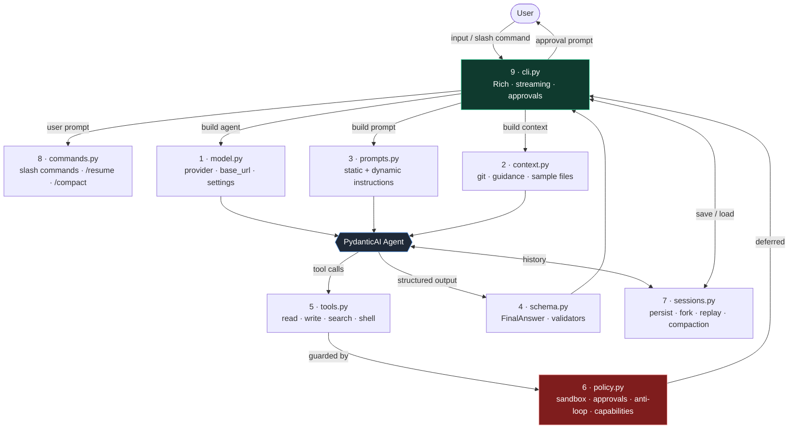
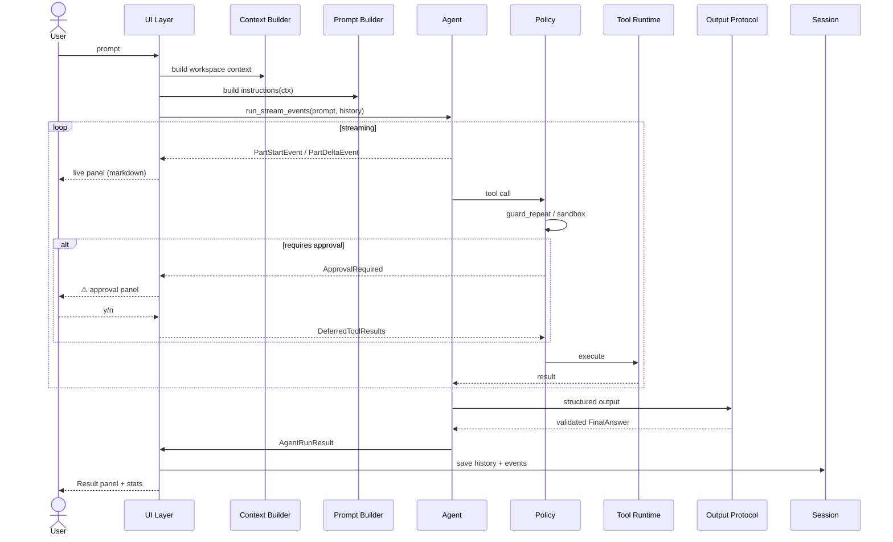

# Pydantic Harness Lab

Um projeto didático **e fábrica de harnesses** para construir agents em cima do PydanticAI, organizado em **9 camadas** independentes. Misturando:

- a legibilidade e o loop explícito do `mini-coding-agent`
- a separação de camadas, sessão e extensões do `pi`
- os recursos modernos do **PydanticAI**: `deps_type`, `instructions`, `output_type`, `history_processors`, `Capabilities`, `DeferredToolRequests`, `run_stream_events()`, `PromptedOutput` e validação estruturada.

> Use este repo como **template** para criar harnesses de outros agentes (suporte, code review, data analysis, devops, etc.). Cada camada é um ponto de extensão isolado — você troca o que precisa e mantém o resto.

## Arquitetura (9 camadas)



### Ciclo de uma turn



## Usando como fábrica para outros agentes

Cada camada é independente. Pra criar um harness novo (ex: agent de suporte, devops, data) você fork o repo e ataca as camadas nesta ordem:

```mermaid
flowchart LR
    A[1. schema.py<br/>'o que o agente devolve?'] --> B[2. tools.py<br/>'quais ações ele faz?']
    B --> C[3. policy.py<br/>'o que é seguro?']
    C --> D[4. context.py<br/>'o que ele precisa saber?']
    D --> E[5. prompts.py<br/>'qual a personalidade?']
    E --> F[6. model.py<br/>'qual modelo / provider?']
    F --> G[7. sessions.py<br/>'persiste o quê?']
    G --> H[8. commands.py<br/>'comandos úteis?']
    H --> I[9. cli.py<br/>'render final']
```



### Checklist por camada

| # | Camada | Decisões obrigatórias | Pontos de extensão típicos |
| --- | -------- | ------------------------ | ---------------------------- |
| 1 | **schema.py** | Quais campos o `FinalAnswer` precisa? Há mais de um tipo de output? | Trocar `FinalAnswer` por seu schema. Adicionar validators (`@agent.output_validator`) que rejeitam saídas inválidas com `ModelRetry`. |
| 2 | **tools.py** | Quais ações o agente realiza? Quais tocam o mundo externo? | Substituir `read/write/search/shell` por suas tools. Cada tool é `@agent.tool` async. Use `RunContext[Deps]` pra acessar estado. |
| 3 | **policy.py** | O que é leitura vs escrita? O que precisa de aprovação? Há sandbox? | Editar `RuntimePolicy`: `requires_write_approval`, `check_shell_allowed`, `skip_path`, `protected_names`, `dangerous_shell_fragments`. Capabilities (`AbstractCapability`) cobrem cross-cutting (auditoria, visibilidade de tools por contexto). |
| 4 | **context.py** | Que contexto vai no prompt? Git? Banco? Configs? Documentos? | `WorkspaceContext` é só uma `BaseModel`. Para outros domínios, troque `_load_guidance_files`/`_sample_files` por buscas em DB, API, índice vetorial, etc. |
| 5 | **prompts.py** | Qual a persona? Quais regras invariantes? Qual contexto dinâmico? | `build_static_instructions()` define prefix prompt. `build_dynamic_instructions(ctx)` recebe `RunContext` e injeta info da turn. |
| 6 | **model.py** | Qual provider? Qual `base_url`/`api_key`? Quais settings? Failover? | Hoje suporta OpenAI-compat via `OPENAI_BASE_URL`. Para outros providers, importe `AnthropicModel`/`GoogleModel`/etc. e instancie em `build_model()`. Cost routing/fallback entram aqui. |
| 7 | **sessions.py** | Persistir histórico? Onde? Eventos auditáveis? Compaction? | `SessionStore` salva em disco. Pra escalar, troque por SQLite/Postgres. `history_processor` define a estratégia de compaction enviada ao modelo. |
| 8 | **commands.py** | Quais slash commands fazem sentido pro seu domínio? | Adicione `CommandSpec` em `default_extensions()`. Cada handler recebe `ExtensionState` (console + deps + session). Útil pra debug, admin, contexto. |
| 9 | **cli.py** | CLI? TUI? Web? API? Que feedback de progresso? | `HarnessCliApp` é só um exemplo. O `Agent` pode ser embarcado em FastAPI, Discord bot, etc. — basta replicar o loop de `run_stream_events`. |

### Cuidados ao adaptar

- **Defina o `output_type` primeiro.** Ele é o contrato — todo o resto (tools, prompt, validators) gira em torno dele.
- **Toda tool que toca o mundo externo precisa de aprovação OU sandbox.** Adicione na `Policy Layer`, não na tool. Isso mantém a tool ingênua e a política auditável.
- **Não esconda erros do modelo.** Use `ModelRetry("mensagem útil")` pra que o agente entenda o que fazer diferente. Stack traces silenciosos confundem o loop.
- **`guard_repeat` registra DEPOIS do sucesso** (não antes) — caso contrário, tools com aprovação ficam bloqueadas no retry.
- **Evite `recent_calls` ilimitado.** Já está bounded em `REPEAT_GUARD_MAX=256`. Se aumentar histórico, ajuste.
- **Streaming estruturado**: `PromptedOutput(FinalAnswer)` faz o modelo emitir JSON como texto, permitindo stream token-a-token. Sem isso, providers que mandam tool calls inteiros (glm, alguns groq) entregam o resultado de uma vez.
- **Approval mode**: `manual` exige confirmação para tudo que escreve; `auto-safe` aprova writes mas pede shell; `never` nega tudo. Sempre passe pela camada Policy.
- **Sessões em disco**: `.harness/<id>/messages.json` + `events.jsonl`. Não versionar (já está no `.gitignore`).
- **Tokens e custo**: o `_render_stats` mostra `input/output/total/requests` por turn. Use isso pra calibrar prompt size e compaction.
- **Capabilities** (`AbstractCapability`) são o lugar certo pra cross-cutting: rate limiting, telemetria, RBAC, masking de PII. Não polua a tool runtime com isso.

### Anti-checklist (o que NÃO fazer)

- ❌ Não meta lógica de policy dentro das tools — vira ingovernável.
- ❌ Não use `print()` direto — sempre `self.console.print` pra respeitar o `Live`/`Progress` ativo.
- ❌ Não chame `console.status()` durante streaming de texto — o `Live` interfere com `print(end="")`. Pare o spinner no primeiro evento.
- ❌ Não bloqueie o event loop com `input()` síncrono — use `asyncio.to_thread(Confirm.ask, ...)`.
- ❌ Não confie em allowlist de shell por substring — prefira validar comando inteiro ou desabilitar shell por padrão.

## Estrutura

```text
agent_harness/
  model.py        # 1 · provider + settings + base_url/api_key
  context.py      # 2 · workspace snapshot (git, guidance, samples)
  prompts.py      # 3 · static + dynamic instructions
  schema.py       # 4 · FinalAnswer + output validators
  tools.py        # 5 · read/write/search/shell tool runtime
  policy.py       # 6 · sandbox, approvals, anti-loop, capabilities
  sessions.py     # 7 · disk persistence, fork, replay, compaction
  commands.py     # 8 · slash commands (/help /resume /compact ...)
  cli.py          # 9 · Rich CLI app, streaming, approval prompts
```

## Ideia central

Cada arquivo representa uma camada separada do harness:

1. **Model Adapter** → resolve modelo, settings e modo de execução
2. **Context Builder** → coleta contexto do workspace
3. **Prompt Builder** → monta instruções estáticas e dinâmicas
4. **Output Protocol** → define o contrato final e valida a saída
5. **Tool Runtime** → registra e executa tools reais
6. **Policy Layer** → sandbox, anti-loop, approval e capabilities
7. **Session Layer** → persistência, fork, replay e compaction
8. **Extension Layer** → slash commands e extensibilidade estilo `pi`
9. **UI Layer** → CLI/TUI com Rich e streaming de eventos

## Fluxo

```text
user input
  -> cli
  -> prompts + context
  -> Agent(...)
  -> tools / policy
  -> schema
  -> sessions
  -> rich cli render
```

## Como rodar

```bash
uv venv
uv pip install -e .
export OPENAI_API_KEY=...
harness-lab
```

## Variáveis úteis

- `HARNESS_MODEL` → ex. `openai:gpt-5.2`
- `HARNESS_WORKSPACE` → diretório do repositório alvo
- `HARNESS_READ_ONLY=true`
- `HARNESS_APPROVAL_MODE=manual`
- `HARNESS_SESSION_DIR=.harness`
- `HARNESS_SHOW_THINKING=false`

## O que este projeto quer ensinar

### O melhor do `mini-coding-agent`

- fluxo simples e rastreável
- foco em workspace + ferramentas
- política explícita
- clareza sobre o ciclo: contexto → modelo → tools → resposta

### O melhor do `pi`

- camadas separadas
- persistência de sessão
- fork/replay
- extensões e slash commands
- CLI como runtime, não só demo

### O melhor do PydanticAI

- structured output com validação tipada
- deferred tools para approval humano
- capabilities para cross-cutting concerns
- history processors para compaction
- run_stream_events para observabilidade na CLI

## Observações

- O projeto é didático, mas funcional.
- O `output_type` usa `FinalAnswer | DeferredToolRequests` para demonstrar final estruturado e human-in-the-loop.
- O `run_shell` sempre pede aprovação para deixar a política visível.
- O compaction é conservador: reduz contexto enviado ao modelo, mas preserva histórico completo no disco.
