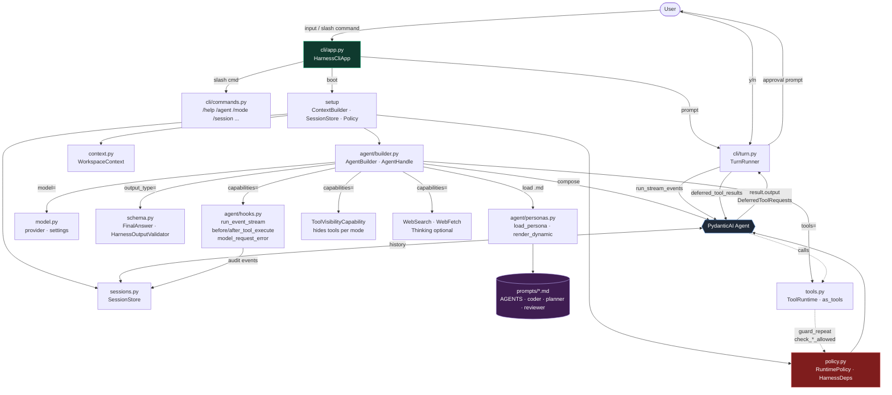
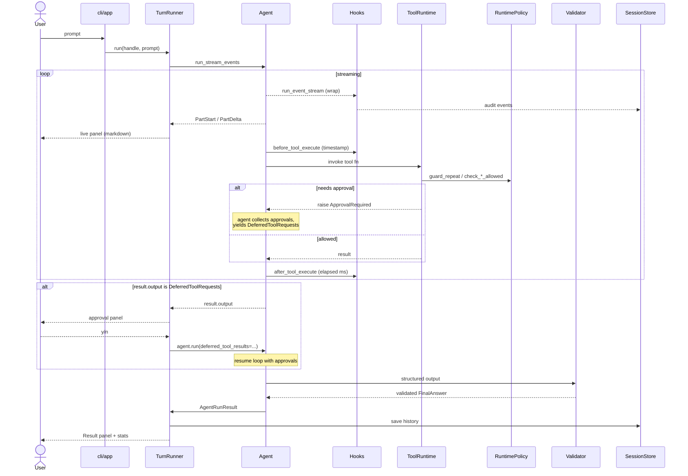
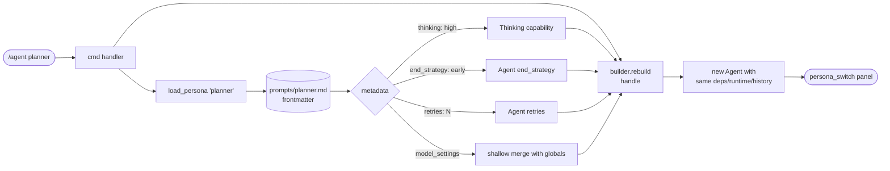

# Harness Lab

A learning project and template to build coding agents on top of
**PydanticAI**. It has clear layers, personas written as Markdown
files with YAML frontmatter, lifecycle hooks, Rich streaming, and
deferred tools for human approval.

It mixes ideas from:

- [mini-coding-agent](https://github.com/rasbt/mini-coding-agent) --
  simple loop, easy to read
- [pi-mono](https://github.com/badlogic/pi-mono/) -- layer split,
  sessions, slash commands
- PydanticAI features: `Agent`, `Capabilities`, `Hooks`,
  `DeferredToolRequests`, `run_stream_events()`, `PromptedOutput`,
  output validators, history processors

## Architecture



### Turn lifecycle



### Persona switch (/agent)



## Structure

```text
src/
├── agent/                  # everything that composes the pydantic_ai.Agent
│   ├── __init__.py         # re-exports
│   ├── builder.py          # AgentBuilder + AgentHandle
│   ├── hooks.py            # build_harness_hooks (4 hooks)
│   └── personas.py         # load_persona · render_dynamic · PromptDocument
├── prompts/                # pure data (no __init__.py)
│   ├── AGENTS.md           # default persona
│   ├── _dynamic.md         # template injected per turn
│   ├── coder.md            # read-write, low temperature
│   ├── planner.md          # read-only, thinking high, early stop
│   └── reviewer.md         # read-only, thinking medium, exhaustive
├── cli/                    # terminal UI
│   ├── __main__.py
│   ├── app.py              # HarnessCliApp
│   ├── commands.py         # slash commands
│   ├── renderer.py         # StreamRenderer (Rich/Live/Progress)
│   └── turn.py             # TurnRunner
├── context.py              # WorkspaceContext (git + samples)
├── model.py                # HarnessSettings + ModelAdapter
├── policy.py               # RuntimePolicy + ToolVisibilityCapability
├── schema.py               # FinalAnswer + HarnessOutputValidator
├── sessions.py             # SessionStore (disk persistence)
└── tools.py                # ToolRuntime + as_tools()
```

## Layers and how to extend

| Layer                            | What it does                                       | How to change it                                                                                        |
| -------------------------------- | -------------------------------------------------- | ------------------------------------------------------------------------------------------------------- |
| `model.py`                       | Picks model, base_url, api_key, settings           | Swap `build_model()` for Anthropic/Google/Bedrock. Add FallbackModel here.                              |
| `context.py`                     | Snapshot of the workspace (git, guidance, samples) | Replace `_load_guidance_files` with a DB, RAG, or API call.                                             |
| `prompts/` + `agent/personas.py` | Personas as Markdown + frontmatter                 | Drop new `.md` files. Loaded with `load_persona(name)`.                                                 |
| `schema.py`                      | Output shape + validator                           | Swap `FinalAnswer`. Add checks inside `HarnessOutputValidator.__call__`.                                |
| `tools.py`                       | Async tools + `as_tools()`                         | Add a bound method `async (self, ctx, ...)` and list it in `as_tools()`.                                |
| `policy.py`                      | Sandbox, approvals, anti-loop                      | Edit `requires_write_approval`, `check_shell_allowed`. `ToolVisibilityCapability` hides tools per mode. |
| `agent/hooks.py`                 | Lifecycle events                                   | 4 hooks: `run_event_stream`, `before/after_tool_execute`, `model_request_error`.                        |
| `agent/builder.py`               | Puts the final `Agent` together                    | Reads persona frontmatter and applies `retries`, `end_strategy`, `model_settings`, `Thinking`.          |
| `sessions.py`                    | Save and replay                                    | Disk-based `SessionStore` with history processor for compaction.                                        |
| `cli/`                           | Terminal UI                                        | `HarnessCliApp` is one example. `AgentBuilder` works from any frontend.                                 |

## Persona via frontmatter

`.md` + YAML frontmatter drives behavior without touching code:

```yaml
---
name: planner
description: Architecture and planning persona.
default_mode: read-only
default_approval: auto
thinking: high           # -> Thinking(effort='high') capability
end_strategy: early      # -> Agent(end_strategy='early')
retries: 2               # -> Agent(retries=2)
model_settings:          # -> shallow merge with global defaults
  temperature: 0.1
---

You are the planner persona...
```

`AgentBuilder._build_agent` reads `persona.metadata` and applies it.
No special frontmatter -> global defaults apply.

## Running

```bash
uv venv
uv sync
export OPENAI_API_KEY=...         # or compatible (glm, groq, etc.)
uv run python -m src.cli
```

### Slash commands

- `/help` · `/agent [name]` · `/mode [readonly|manual|auto|never]`
- `/context` · `/tools` · `/session` · `/replay`
- `/fork [child_id]` · `/clear` · `/compact [N]` · `/resume [id]`
- `/quit`

### Environment variables

- `HARNESS_MODEL` (e.g. `openai:gpt-5.2`, `openai:glm-5.1`)
- `HARNESS_BASE_URL` (for OpenAI-compatible providers)
- `HARNESS_WORKSPACE` (target directory)
- `HARNESS_READ_ONLY=true`
- `HARNESS_APPROVAL_MODE=manual|auto-safe|never`
- `HARNESS_SESSION_DIR=.harness`
- `HARNESS_SHOW_THINKING=false`

## Principles

- **Persona is data, not code.** Editable Markdown drives behavior
  via frontmatter. `AgentBuilder` is code, personas are content.
- **Every mutating tool goes through the Policy Layer**, never embed
  rules in the tool itself. Policy is auditable, tools stay naive.
- **`ModelRetry("...")`** instead of silent exceptions -- the model
  needs to understand what to do differently.
- **Capabilities for cross-cutting concerns.** Hooks, tool visibility,
  web search, thinking. Don't pollute ToolRuntime.
- **Structured streaming.** `PromptedOutput(FinalAnswer)` allows
  token-by-token streaming of JSON via `_extract_partial_string_field`.
- **Code and data separated.** `src/prompts/` holds only `.md` files,
  `src/agent/personas.py` is the loader.

## References

Projects that inspired or provided patterns:

- [badlogic/pi-mono](https://github.com/badlogic/pi-mono/) --
  layer separation, sessions, slash commands, extensibility
- [rasbt/mini-coding-agent](https://github.com/rasbt/mini-coding-agent/) --
  explicit loop, clarity of the context → tools → response cycle
- [drona23/claude-token-efficient](https://github.com/drona23/claude-token-efficient/) --
  compaction and token efficiency strategies
- [Leonxlnx/agentic-ai-prompt-research](https://github.com/Leonxlnx/agentic-ai-prompt-research) --
  prompt engineering patterns for agents
- [pydantic/pydantic-ai](https://ai.pydantic.dev/) -- base framework
