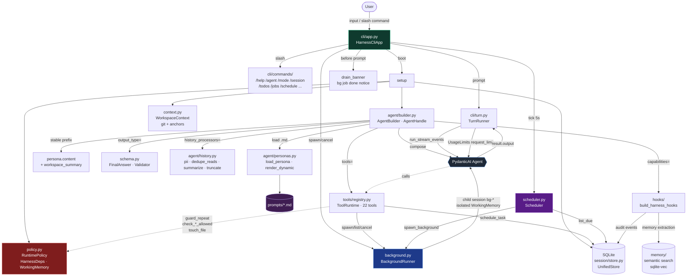
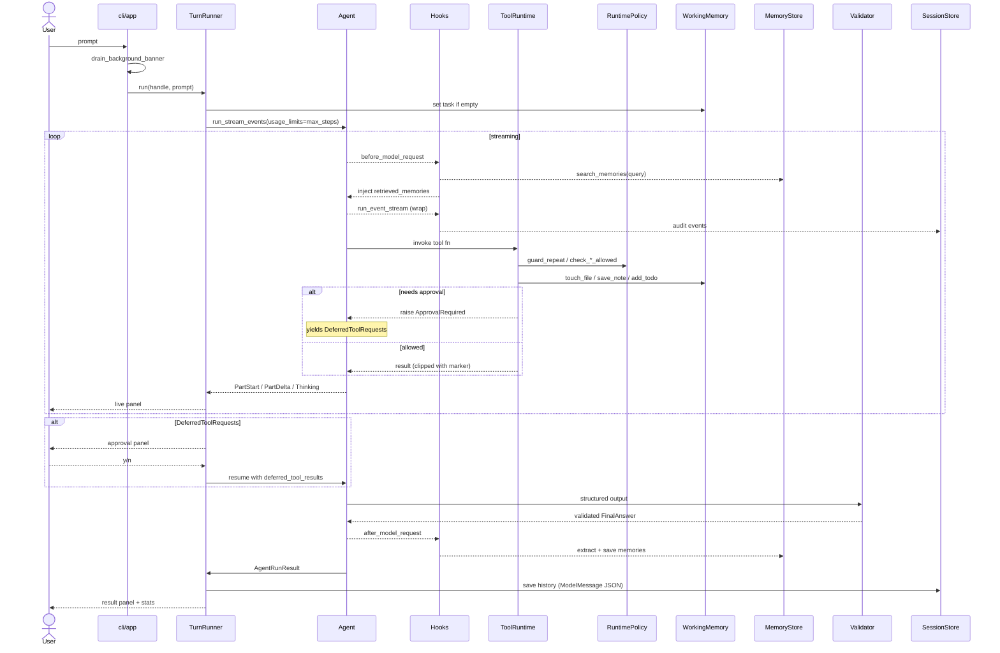
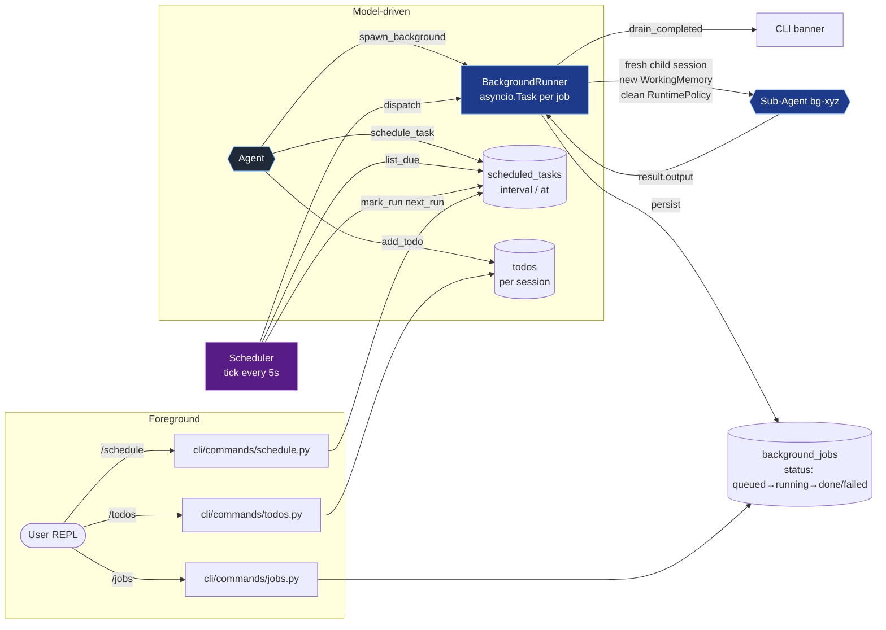
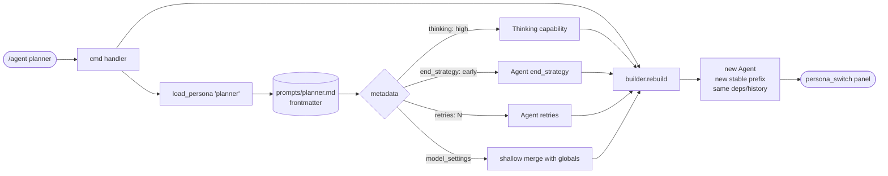

# Harness Lab

A learning project and template to build coding agents on top of
**PydanticAI**. It has clear layers, personas written as Markdown
files with YAML frontmatter, lifecycle hooks, Rich streaming,
deferred tools for human approval, persistent session memory with
semantic recall, per-session todos, background agent runs, and an
in-process scheduler for recurring tasks.

It mixes ideas from:

- [mini-coding-agent](https://github.com/rasbt/mini-coding-agent) --
  simple loop, easy to read
- [pi-mono](https://github.com/badlogic/pi-mono/) -- layer split,
  sessions, slash commands
- PydanticAI features: `Agent`, `Capabilities`, `Hooks`,
  `DeferredToolRequests`, `run_stream_events()`, `ToolOutput`,
  `output_validator`, history processors, `UsageLimits`, MCP

## Architecture



### Turn lifecycle



### Background + scheduler



### Persona switch (/agent)



## Structure

```text
src/
├── __init__.py
├── prompts/                   # markdown prompt source (see prompts/README.md)
│   ├── agents/                # personas + helper agents
│   ├── instructions/          # project + dynamic templates
│   ├── rules/                 # always-on discipline
│   └── skills/                # on-demand knowledge modules
│
├── schema.py                  # FinalAnswer · HarnessOutputValidator
├── context.py                 # WorkspaceContext · ContextBuilder
├── model.py                   # HarnessSettings · ModelAdapter
├── policy.py                  # RuntimePolicy · HarnessDeps · WorkingMemory
├── background.py              # BackgroundRunner (async tasks)
├── scheduler.py               # Scheduler (in-process tick loop)
│
├── agent/                     # Agent composition (see agent/README.md)
│   ├── builder.py             # AgentBuilder · AgentHandle
│   ├── delegation.py          # delegate_to_<persona> with bounded sub_deps
│   ├── history.py             # pii / dedupe_reads / summarize / truncate
│   ├── personas.py            # load_persona · render_dynamic
│   └── watcher.py             # hot-reload of src/prompts
│
├── hooks/                     # pydantic-ai Hooks capability (see hooks/README.md)
│   └── hooks.py               # run_event_stream, before/after_* , memory inject
│
├── memory/                    # long-term semantic memory
│   ├── schema.py              # MemoryEntry (sqlmodel)
│   ├── extractor.py           # LLM-driven extraction agent
│   └── store.py               # MemoryStore facade over UnifiedStore
│
├── session/                   # SQLite persistence layer
│   ├── database.py            # DatabaseManager (schema create_all)
│   ├── schema.py              # SessionModel · Message · Event · Todo · BackgroundJob · ScheduledTask
│   ├── store.py               # UnifiedStore (facade over repos)
│   └── repos/
│       ├── session.py         # SessionRepository
│       ├── message.py         # MessageRepository (ModelMessage JSON)
│       ├── event.py           # EventRepository (audit log)
│       ├── memory.py          # MemoryRepository (sqlite-vec)
│       ├── todo.py            # TodoRepository
│       ├── background.py      # BackgroundJobRepository
│       └── scheduled.py       # ScheduledTaskRepository
│
├── tools/                     # Agent-callable tools (22)
│   ├── _clip.py               # truncation helper with marker
│   ├── policy.py              # PolicyGuard wrapper
│   ├── registry.py            # ToolRuntime · ToolRegistry · TOOL_NAMES
│   ├── file.py                # list/read/write/replace (+ mtime cache)
│   ├── search.py              # search_text
│   ├── shell.py               # run_shell (approval-gated)
│   ├── notes.py               # save_note · query_notes (working memory)
│   ├── todos.py               # add/list/update/delete_todo
│   ├── background.py          # spawn_background + get_job_status/result/cancel
│   └── scheduling.py          # schedule_task · list/pause/resume/cancel_scheduled
│
└── cli/                       # terminal UI
    ├── __main__.py
    ├── app.py                 # HarnessCliApp (boots scheduler + bg runner)
    ├── turn.py                # TurnRunner (Rich-driven stream loop)
    ├── step.py                # StepRunner (agent.iter debug)
    ├── commands/              # slash command handlers
    │   ├── base.py            # ExtensionState · CommandSpec
    │   ├── registry.py        # default_extensions()
    │   ├── session.py         # /session /fork /replay /clear /compact /resume
    │   ├── agent.py           # /agent /mode /step
    │   ├── memory.py          # /memory /forget
    │   ├── todos.py           # /todos
    │   ├── jobs.py            # /jobs (background monitor)
    │   ├── schedule.py        # /schedule
    │   └── misc.py            # /help /context /tools /attach
    └── ui/                    # Rich components
        ├── renderer.py        # StreamRenderer (Live + Panel + Markdown)
        ├── panels.py
        ├── progress.py
        ├── stats.py
        └── tools.py
```

## 22 tools

| Category   | Tools                                                                                        |
| ---------- | -------------------------------------------------------------------------------------------- |
| Read       | `list_files`, `read_file` (mtime-cached), `search_text`                                      |
| Mutate     | `write_file`, `replace_in_file`                                                              |
| Shell      | `run_shell` (approval-gated)                                                                 |
| Memory     | `save_note`, `query_notes` (session working memory)                                          |
| Todos      | `add_todo`, `list_todos`, `update_todo`, `delete_todo`                                       |
| Background | `spawn_background`, `list_background_jobs`, `get_job_status`, `get_job_result`, `cancel_job` |
| Scheduling | `schedule_task`, `list_scheduled`, `pause_scheduled`, `resume_scheduled`, `cancel_scheduled` |

All tool outputs flow through `src/tools/_clip.py` so truncation is
visible to the model (`...[truncated N chars]`).

## Layers and how to extend

| Layer                            | What it does                                            | How to change it                                                                                         |
| -------------------------------- | ------------------------------------------------------- | -------------------------------------------------------------------------------------------------------- |
| `model.py`                       | Picks model, base_url, api_key, ModelSettings           | Swap `build_model()`. Add FallbackModel here.                                                            |
| `context.py`                     | Snapshot of workspace (git, guidance files, samples)    | Replace `_load_guidance_files` with DB / RAG / API.                                                      |
| `prompts/` + `agent/personas.py` | Personas as Markdown + frontmatter                      | Drop new `.md` file. `load_persona(name)`.                                                               |
| `schema.py`                      | Output shape + validator                                | Swap `FinalAnswer`. Add checks in `HarnessOutputValidator`.                                              |
| `policy.py`                      | Sandbox, approvals, anti-loop, `WorkingMemory`          | `check_shell_allowed`, `requires_write_approval`, `WorkingMemory.save_note`.                             |
| `tools/*.py`                     | Closed set of 22 typed tools                            | Add method on a `*Tools` class → register in `tools/registry.py`.                                        |
| `hooks/`                         | Lifecycle: memory injection, audit, timings, extraction | New hook registered in `build_harness_hooks()`.                                                          |
| `agent/history.py`               | Context reduction pipeline                              | PII filter → dedupe_reads → summarize → adaptive trim → fixed trim.                                      |
| `agent/builder.py`               | Composes final `Agent`                                  | Renders stable prefix, wires tools/hooks/history, delegation.                                            |
| `agent/delegation.py`            | Bounded sub-agents                                      | Fresh `sub_deps`: `read_only=True`, `approval_mode=never`, clean `RuntimePolicy`, clean `WorkingMemory`. |
| `session/`                       | SQLite persistence                                      | Repos: session, message, event, memory, todo, background, scheduled.                                     |
| `memory/`                        | Long-term semantic memory                               | LLM extractor + sqlite-vec semantic search.                                                              |
| `background.py`                  | Off-REPL agent runs                                     | `BackgroundRunner.spawn` creates `asyncio.Task` per job.                                                 |
| `scheduler.py`                   | In-process cron                                         | Tick every 5s. `every 30m`, `every 2h`, `at 14:30`, `at <ISO>`.                                          |
| `cli/`                           | Terminal UI                                             | `HarnessCliApp` boots scheduler + bg runner; banners on next prompt.                                     |

## Persona via frontmatter

`.md` + YAML frontmatter drives behavior without touching code:

```yaml
---
name: planner
description: Architecture and planning persona.
default_mode: read-only
default_approval: auto
thinking: high           # -> Thinking(effort='high') capability
end_strategy: early      # -> Agent(end_strategy='early')
retries: 2               # -> Agent(retries=2)
model_settings:          # -> shallow merge with global defaults
  temperature: 0.1
delegates:               # -> tool delegate_to_coder / delegate_to_reviewer
  - coder
  - reviewer
---

You are the planner persona...
```

`AgentBuilder._build_agent` reads `persona.metadata` and applies it.
No special frontmatter -> global defaults apply.

## Prompt shape (cache reuse)

Instructions are split into a **stable prefix** (rendered once at
build time) and a **volatile suffix** (rebuilt per turn). The stable
prefix sits in `instructions=` so prompt caching on Anthropic / OpenAI
reuses the prefix between turns; only the volatile fields change.

```text
┌─────────────────────────────────────┐  <- instructions= (static)
│ persona.content                     │
│ ## Workspace                        │
│ (prompt_summary: git, guidance, …)  │
├─────────────────────────────────────┤  <- @agent.instructions (dynamic)
│ Session id, persona, mode           │
│ Working memory (task, files, notes) │
│ Open todos count                    │
│ Recent session signals              │
│ Relevant long-term memories         │
└─────────────────────────────────────┘
```

## Running

```bash
uv venv
uv sync
export OPENAI_API_KEY=...         # or compatible (glm, groq, etc.)
uv run python -m src.cli
```

### Slash commands

Session + UI:

- `/help` · `/context` · `/tools`
- `/session` · `/fork [id]` · `/replay` · `/clear` · `/compact [N]` · `/resume [id]`
- `/agent [name]` · `/mode [readonly|manual|auto|never]` · `/step <prompt>`
- `/attach <path|url>`

Memory + tasks:

- `/memory` · `/forget <id>` -- long-term semantic memory
- `/todos` · `/todos add <title>` · `/todos done|doing|rm <id>`
- `/jobs` · `/jobs show <id>` · `/jobs cancel <id>`
- `/schedule` · `/schedule add <when> :: <prompt>` · `/schedule pause|resume|rm <id>`

`/quit`

Schedule formats: `every 30m`, `every 2h`, `every 45s`, `every 1d`,
`at 14:30`, `at 2026-05-01T09:00`.

### Environment variables

- `MODEL` (e.g. `openai:gpt-5.2`, `anthropic:claude-sonnet-4-5`)
- `OPENAI_BASE_URL` (for OpenAI-compatible providers)
- `OPENAI_API_KEY`
- `HARNESS_WORKSPACE` (target directory)
- `HARNESS_READ_ONLY=true`
- `HARNESS_APPROVAL_MODE=manual|auto-safe|never`
- `HARNESS_SESSION_DIR=.harness`
- `HARNESS_SHOW_THINKING=false`
- `HARNESS_MAX_STEPS_PER_TURN=12` -- hard cap on per-turn model calls
- `FALLBACK_MODELS=openai:gpt-5.1,anthropic:claude-sonnet-4-5`
- `SUMMARIZE_MODEL=openai:gpt-5.1-mini` -- opt-in history compaction
- `MCP_CONFIG_PATH=.claude/mcp_servers.json` -- opt-in MCP toolsets.
  See [.claude/mcp_servers.example.json](.claude/mcp_servers.example.json)
  for the expected JSON shape (stdio + HTTP servers).
- `ENABLE_MEMORY=true`

### Provider configuration

All providers route through `ModelAdapter` ([src/model.py:133-142](src/model.py#L133-L142)).
`MODEL` uses `provider:model_name` shape. When `OPENAI_BASE_URL` is set,
`ModelAdapter` builds an `OpenAIProvider` + `OpenAIChatModel` pointed at
the given endpoint, so any OpenAI-compatible server works.

**OpenAI (default):**

```bash
export MODEL=openai:gpt-5.2
export OPENAI_API_KEY=sk-...
```

**Anthropic:**

```bash
export MODEL=anthropic:claude-sonnet-4-5
export ANTHROPIC_API_KEY=sk-ant-...
```

**Ollama (local):**

```bash
export MODEL=openai:llama3.1:8b
export OPENAI_BASE_URL=http://localhost:11434/v1
export OPENAI_API_KEY=ollama  # Ollama ignores the value but the SDK requires a non-empty string
```

**Groq:**

```bash
export MODEL=openai:llama-3.3-70b-versatile
export OPENAI_BASE_URL=https://api.groq.com/openai/v1
export OPENAI_API_KEY=gsk_...
```

**GLM / ZhipuAI:**

```bash
export MODEL=openai:glm-4.6
export OPENAI_BASE_URL=https://open.bigmodel.cn/api/paas/v4
export OPENAI_API_KEY=...
```

Fallback chains (`FALLBACK_MODELS`) can mix providers -- if the primary
fails, `FallbackModel` walks the list in order.

## Principles

- **Persona is data, not code.** Editable Markdown drives behavior
  via frontmatter. `AgentBuilder` is code, personas are content.
- **Every mutating tool goes through the Policy Layer**, never embed
  rules in the tool itself. Policy is auditable, tools stay naive.
- **`ModelRetry("...")`** instead of silent exceptions -- the model
  needs to understand what to do differently.
- **Capabilities for cross-cutting concerns.** Hooks, web search,
  thinking, MCP. Don't pollute `ToolRuntime`.
- **Two memory layers.** Long-term semantic memory (sqlite-vec) for
  cross-session facts; `WorkingMemory` (task + files touched + notes)
  for the current session, rendered in the prompt every turn.
- **Stable prefix, volatile suffix.** Prompt caching rewards identical
  prefixes. Workspace snapshot lives in `instructions=`, per-turn
  signals live in `@agent.instructions`.
- **Truncation is visible.** Every clipped tool output ends with
  `...[truncated N chars]` so the model can decide to re-read.
- **Delegation is bounded.** Sub-agents get `read_only=True`,
  `approval_mode=never`, fresh `RuntimePolicy`, clean `WorkingMemory`.
- **Background is first-class.** `spawn_background` hands off
  long-running work, the REPL stays responsive, status shows in
  `/jobs` and persists across restarts.
- **Scheduler is in-process, not cron.** The app owns the scheduler
  lifecycle; tasks survive restart because they live in SQLite, but
  they only fire while the CLI is running.

## References

- [badlogic/pi-mono](https://github.com/badlogic/pi-mono/) -- layer
  separation, sessions, slash commands, extensibility
- [rasbt/mini-coding-agent](https://github.com/rasbt/mini-coding-agent/) --
  explicit loop, clarity of the context → tools → response cycle
- [drona23/claude-token-efficient](https://github.com/drona23/claude-token-efficient/) --
  compaction and token efficiency strategies
- [Leonxlnx/agentic-ai-prompt-research](https://github.com/Leonxlnx/agentic-ai-prompt-research) --
  prompt engineering patterns for agents
- [pydantic/pydantic-ai](https://ai.pydantic.dev/) -- base framework

## Module docs

Every `src/` sub-package has a README with a file-by-file map:

- [src/README.md](src/README.md) -- runtime overview + boot order
- [src/agent/README.md](src/agent/README.md) -- personas, builder, history
- [src/prompts/README.md](src/prompts/README.md) -- prompt layers
- [src/tools/README.md](src/tools/README.md) -- tool registry + categories
- [src/session/README.md](src/session/README.md) -- sqlite store + repos
- [src/memory/README.md](src/memory/README.md) -- long-term memory
- [src/hooks/README.md](src/hooks/README.md) -- runtime vs shell hooks
