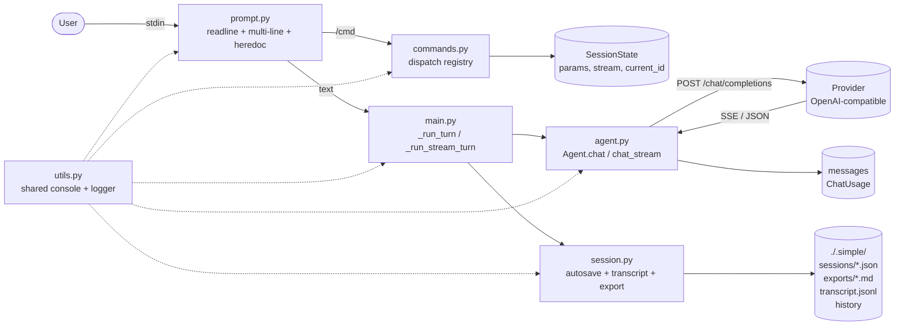

# Simple Agent

A tiny command-line harness to try out OpenAI-compatible APIs
(OpenAI, Mistral, xAI, Ollama, and so on). This was the starting
point of the lab, inspired by the
[Identity](https://www.youtube.com/watch?v=LykXu60aKoY) video.

Goal: see the basic agent loop --
`input -> system prompt + history -> provider -> reply` -- with no
framework in the way. Just `httpx` + `rich` + the standard
library.

## Architecture



## Modules

| Module                         | What it does                                             |
| ------------------------------ | -------------------------------------------------------- |
| [main.py](src/main.py)         | CLI args, REPL loop, streaming render                    |
| [agent.py](src/agent.py)       | `Agent`, `AgentConfig`, `ChatResponse`, retry, compact   |
| [commands.py](src/commands.py) | Slash command registry (`/stream`, `/retry`, ...)        |
| [prompt.py](src/prompt.py)     | Readline input, multi-line `\` + heredoc `<<<`, prefill  |
| [session.py](src/session.py)   | `SessionState`, JSON autosave, JSONL transcript, export  |
| [utils.py](src/utils.py)       | Shared `console` (Rich) + `logger` (RichHandler)         |

## Key parts

### `Agent` ([agent.py](src/agent.py))

- `chat(user_input, params)` -- one call, returns `ChatResponse`.
- `chat_stream(user_input, on_content, on_reasoning, params)` --
  reads SSE and calls the callbacks for each delta.
- `compact(keep_last=4)` -- asks the model to summarize old
  messages, keeps the last N; stashes a snapshot for `undo_compact`.
- `undo_compact()` -- restores the pre-compact history.
- `pop_last_user()` -- drops the last user message (and anything
  after); returns the content. Used by `/retry` and `/edit`.
- `models()` -- lists provider models, cached for 60s.
- `_post_with_retry` -- 3 tries, retries 5xx and 429 (honors
  `Retry-After`), exponential backoff otherwise.

### `AgentConfig` ([agent.py](src/agent.py))

Reads `MODEL`, `BASE_URL`, `API_KEY` from `.env`. Has a generic
default `system_prompt`, and an optional `instructions` string
appended to it. Timeouts are separated:

- `CONNECT_TIMEOUT` (default 10s)
- `READ_TIMEOUT` (default 60s)
- `STREAM_READ_TIMEOUT` (default unlimited -- SSE idles between
  tokens)

### `ChatParams` ([agent.py](src/agent.py))

A TypedDict with `temperature`, `top_p`, `max_tokens`, `seed`, and
`reasoning_effort`. Sent as extra fields in the request body.

Provider reasoning is normalized: `_extract_reasoning` picks up
either `reasoning_content` (Mistral magistral, OpenAI o-series) or
`reasoning` (xAI).

### `SessionState` ([session.py](src/session.py))

REPL state: `stream_mode`, `params`, `current_id` (persistent
across load/save), plus runtime-only `pending_input` (for `/retry`)
and `prefill` (for `/edit`).

### Commands registry ([commands.py](src/commands.py))

The `@register("/name")` decorator fills `_REGISTRY`. Each handler
takes `(agent, state, arg)` and returns `bool` (True = exit the
REPL). The shared `console` comes from `utils.py`, so handlers
don't need it as a parameter.

### Shared utilities ([utils.py](src/utils.py))

A single `rich.Console` + stdlib `logging` wired through
`RichHandler`. Every module imports `console` and `logger` from
here so output and logs share the same terminal and formatting.

## CLI args

```bash
simple                              # new session
simple -c                           # resume most recent session
simple -c --compact                 # resume + compact old history
simple --session <id>               # resume by id
simple --model <id>                 # override model
simple --instructions "<text>"      # extra system instructions
simple --no-stream                  # disable streaming
simple --log-level DEBUG            # see HTTP retries, turns
simple --diagram [flow|lifecycle]   # render architecture (default: both)
```

## Slash commands

| Command                           | What it does                                       |
| --------------------------------- | -------------------------------------------------- |
| `/help`                           | list commands                                      |
| `/stream`                         | toggle streaming on/off                            |
| `/thinking [low|medium|high|off]` | show or set `reasoning_effort`                     |
| `/usage`                          | show session token usage                           |
| `/clear`                          | clear history in memory                            |
| `/session [<id>|reset]`           | list / load / delete saved sessions                |
| `/set <key> [value]`              | set chat param (unset if value missing)            |
| `/params`                         | show current params                                |
| `/model [<id>]`                   | list models or switch                              |
| `/instructions [<text>]`          | read or set extra instructions                     |
| `/compact [<keep>|undo]`          | summarize history, keep last N; `undo` reverts     |
| `/retry`                          | drop last assistant reply and re-run               |
| `/edit`                           | drop last assistant reply and re-edit input        |
| `/history [N]`                    | show last N messages                               |
| `/export [path]`                  | export conversation as markdown                    |
| `/diagram [flow\|lifecycle]`      | render netext architecture diagram (default: both) |
| `/quit`, `/exit`                  | leave (autosaves)                                  |

## Multi-line input

Three ways to send text spanning several lines:

1. **Backslash continuation**: end a line with `\`, the REPL opens
   a `...` continuation prompt.
2. **Heredoc**: type `<<<` (or `<<< TAG`) alone; everything until a
   line with just `<<<` (or `TAG`) becomes the input.
3. **Paste and Enter**: for short snippets.

## Storage

Everything lives under `./.simple/`:

- `sessions/<id>.json` -- full state (model, params, messages,
  usage, created_at, updated_at). Autosaved per turn and on exit;
  the same `id` is reused across resume.
- `exports/<id>.md` -- markdown export via `/export`.
- `transcript.jsonl` -- append-only log of every turn with
  `session_id`, `model`, `tokens`, `response_time`.
- `history` -- readline prompt history.

## Running

```bash
cp .env.example .env  # set MODEL, BASE_URL, API_KEY
uv run simple
```

Example `.env` values:

```bash
# Mistral
MODEL=mistral-large-latest
BASE_URL=https://api.mistral.ai/v1
API_KEY=...

# xAI
MODEL=grok-2-latest
BASE_URL=https://api.x.ai/v1
API_KEY=...

# Ollama (local)
MODEL=llama3.1
BASE_URL=http://localhost:11434/v1
API_KEY=ollama
```

Optional tuning:

```bash
CONNECT_TIMEOUT=10
READ_TIMEOUT=60
STREAM_READ_TIMEOUT=none      # unlimited for SSE
LOG_LEVEL=WARNING             # or DEBUG / INFO
```

Note: `reasoning_effort` only works on models that support
reasoning (for example `magistral-*`, `gpt-5`,
`grok-*-reasoning`).
