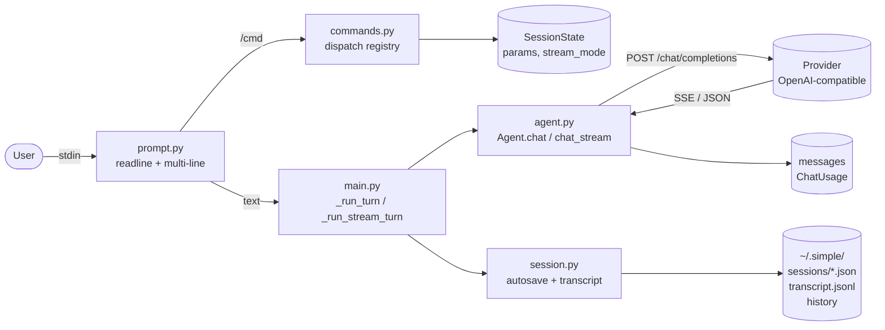

# Simple Agent

A tiny command-line harness to try out OpenAI-compatible APIs
(OpenAI, Mistral, xAI, Ollama, and so on). This was the starting
point of the lab, inspired by the
[Identity](https://www.youtube.com/watch?v=LykXu60aKoY) video.

Goal: see the basic agent loop --
`input -> system prompt + history -> provider -> reply` -- with no
framework in the way. Just `httpx` + `rich` + the standard
library.

## Architecture



## Modules

| Module                         | What it does                                             |
| ------------------------------ | -------------------------------------------------------- |
| [main.py](src/main.py)         | REPL loop; routes `/cmd` or prompt; renders streaming    |
| [agent.py](src/agent.py)       | `Agent`, `AgentConfig`, `ChatResponse`, retry, compact   |
| [commands.py](src/commands.py) | Slash command registry (`/stream`, `/thinking`, ...)     |
| [prompt.py](src/prompt.py)     | Readline input, multi-line with `\`, saved history       |
| [session.py](src/session.py)   | `SessionState`, JSON autosave, JSONL transcript          |

## Key parts

### `Agent` ([agent.py:136](src/agent.py#L136))

- `chat(user_input, params)` -- one call, returns `ChatResponse`.
- `chat_stream(user_input, on_content, on_reasoning, params)` --
  reads SSE and calls the callbacks for each delta.
- `compact(keep_last=4)` -- asks the model to summarize old
  messages, keeps the last N.
- `models()` -- lists provider models (`GET /models`).
- `_post_with_retry` -- 3 tries, exponential backoff, retries 5xx
  only.

### `AgentConfig` ([agent.py:113](src/agent.py#L113))

Reads `MODEL`, `BASE_URL`, `API_KEY` from `.env`. Has a generic
default `system_prompt`, and an optional `instructions` string
added after it.

### `ChatParams` ([agent.py:33](src/agent.py#L33))

A TypedDict with `temperature`, `top_p`, `max_tokens`, `seed`, and
`reasoning_effort`. Sent as extra fields in the request body.

### `SessionState` ([session.py:14](src/session.py#L14))

REPL state: `stream_mode` and `params`. Saved on autosave.

### Commands registry ([commands.py:55](src/commands.py#L55))

The `@register("/name")` decorator fills `_REGISTRY`. Each handler
takes `(console, agent, state, arg)` and returns `bool` (True =
exit the REPL).

## Slash commands

| Command                           | What it does                             |
| --------------------------------- | ---------------------------------------- |
| `/help`                           | list commands                            |
| `/stream`                         | toggle streaming on/off                  |
| `/thinking [low|medium|high|off]` | set `reasoning_effort`                   |
| `/usage`                          | show session token usage                 |
| `/clear`                          | clear history in memory                  |
| `/session [<id>|reset]`           | list / load / delete saved sessions      |
| `/set <key> [value]`              | set chat param (unset if value missing)  |
| `/params`                         | show current params                      |
| `/model [<id>]`                   | list models or switch                    |
| `/instructions [<text>]`          | read or set extra instructions           |
| `/compact [<keep>]`               | summarize old history, keep last N       |
| `/quit`, `/exit`                  | leave (autosaves)                        |

## Storage

Everything lives under `~/.simple/`:

- `sessions/<id>.json` -- full state (model, params, messages,
  usage) saved when you exit.
- `transcript.jsonl` -- append-only log of every turn.
- `history` -- readline prompt history.

## Running

```bash
cp .env.example .env  # set MODEL, BASE_URL, API_KEY
uv run simple
```

Example `.env` values:

```bash
# Mistral
MODEL=mistral-large-latest
BASE_URL=https://api.mistral.ai/v1
API_KEY=...

# xAI
MODEL=grok-2-latest
BASE_URL=https://api.x.ai/v1
API_KEY=...

# Ollama (local)
MODEL=llama3.1
BASE_URL=http://localhost:11434/v1
API_KEY=ollama
```

Note: `reasoning_effort` only works on models that support
reasoning (for example `magistral-*`, `gpt-5`,
`grok-*-reasoning`).
