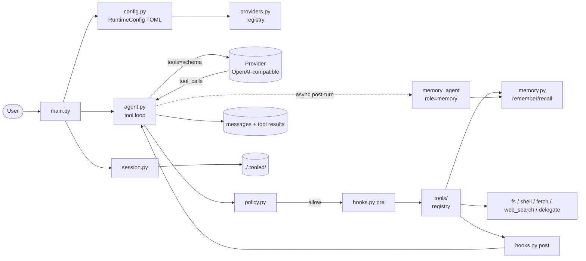

# Tooled Agent

A tool-calling harness extending [simple](../simple/README.md) with
a real agent loop: the model emits tool calls, the harness runs
them, appends the results, and continues until a plain reply.
Async stack throughout (`asyncio` + `httpx.AsyncClient`).

Adds, on top of `simple`:

- `@tool` registry + pydantic-generated JSON schema
- `@hook("pre"/"post")` for observability / redaction / metrics
- `Policy` (allow / confirm / deny) with human approval prompts
- 3-tier memory (session, medium `.md`, long `.jsonl`) + post-turn
  memory agent
- Structured output via `response_model: type[BaseModel]`
- Sub-agent delegation via `delegate` tool
- **Multi-provider + per-role routing** via `.tooled/config.toml`:
  different models/providers for `main`, `compact`, `memory`,
  `delegate`, etc.

## Architecture



## Modules

| Module                           | Responsibility                                                          |
| -------------------------------- | ----------------------------------------------------------------------- |
| [main.py](src/main.py)           | CLI args, REPL loop, streaming render, approval prompt wiring           |
| [agent.py](src/agent.py)         | Async tool loop, `chat`/`chat_stream`, compact, `AgentConfig.from_role` |
| [providers.py](src/providers.py) | `Provider` Protocol + `OpenAICompatProvider` + registry                 |
| [config.py](src/config.py)       | `RuntimeConfig` -- TOML loader, role resolution, env fallback           |
| [tools/](src/tools/)             | `@tool` registry (`fs`, `shell`, `web`, `agent_tool`) + dispatch        |
| [hooks.py](src/hooks.py)         | `@hook("pre"/"post")` registry, `ToolCall` model                        |
| [policy.py](src/policy.py)       | `Policy(allow/confirm/deny)` + persistence                              |
| [memory.py](src/memory.py)       | 3 tiers, memory agent, `remember`/`recall` tools                        |
| [session.py](src/session.py)     | Autosave, transcript, export                                            |
| [commands.py](src/commands.py)   | Slash command registry                                                  |
| [prompt.py](src/prompt.py)       | Readline input (same as simple)                                         |
| [utils.py](src/utils.py)         | Shared `console`, `logger`, `thinking_progress`                         |

## Key parts

### Multi-provider via roles

`.tooled/config.toml` declares **providers** (wire endpoint + env
var for the key) and **roles** (semantic purpose -> provider +
model). The harness boots with a single `RuntimeConfig`; every
sub-agent (`compact`, `memory`, `delegate`) looks up its role and
builds its own `AgentConfig`.

```toml
default_role = "main"

[providers.mistral]
base_url = "https://api.mistral.ai/v1"
api_key_env = "MISTRAL_API_KEY"

[providers.glm]
base_url = "https://api.z.ai/api/paas/v4"
api_key_env = "GLM_API_KEY"

[roles.main]
provider = "mistral"
model = "mistral-large-latest"

[roles.compact]
provider = "mistral"
model = "mistral-small-latest"
temperature = 0.3

[roles.memory]
provider = "glm"
model = "glm-4.6"

[roles.delegate]
provider = "glm"
model = "glm-4.6"
```

If `.tooled/config.toml` is absent, tooled **auto-generates** one at
first run by scanning the environment for `{PREFIX}_API_KEY` vars
(e.g. `MISTRAL_API_KEY`, `GLM_API_KEY`) and registering each as a
provider. The first prefix becomes the `main` provider; `compact`,
`memory`, and `delegate` roles default to the same provider. If no
prefixed vars are found, it falls back to legacy `API_KEY` /
`BASE_URL` / `MODEL`. Edit the generated file to route roles across
providers.

**Env-var convention**: a provider or role may resolve `base_url` or
`model` from env vars instead of hardcoding them:

```toml
[providers.mistral]
base_url_env = "MISTRAL_BASE_URL"   # or: base_url = "..."
api_key_env  = "MISTRAL_API_KEY"

[roles.main]
provider  = "mistral"
model_env = "MISTRAL_MODEL"         # or: model = "..."
```

This lets `.env` hold all credentials/URLs/models while `config.toml`
only describes routing.

### `Provider` + `AgentConfig` ([agent.py](src/agent.py), [providers.py](src/providers.py))

`AgentConfig` carries a `provider: Provider` reference, a `model`
name, optional `temperature`/`max_tokens`/`instructions`, and
timeouts. `AgentConfig.from_role(runtime, "compact")` resolves a
role to a concrete config.

`Provider.build_client(connect, read)` returns a fresh
`httpx.AsyncClient` bound to the provider's base URL + headers.
The default `OpenAICompatProvider` covers OpenAI, Mistral, GLM,
xAI, and tool-capable Ollama.

### `Agent` ([agent.py](src/agent.py))

- `chat(user_input, params)` -- tool loop until `finish_reason !=
  "tool_calls"`. Caps iterations via `max_tool_iterations=10`.
- `chat_stream(...)` -- SSE with `on_content` / `on_reasoning`
  callbacks; falls back to non-stream for tool continuation.
- `compact(keep_last=4)` -- preserves `assistant(tool_calls) ->
  tool` pairs, never splits them. Planned: switch to role `compact`
  sub-agent (Onda 2).
- `pop_last_user()` -- for `/retry`.
- Structured output: set `response_model=SomeBaseModel` on
  construction; replies are validated with `TypeAdapter`.

### Tools ([tools/](src/tools/))

`@tool(name, desc, timeout, returns)` wraps a function, builds a JSON
schema from its signature via `pydantic.create_model`, and
registers into `_REGISTRY`.

- `ctx: RunContext[T]` first param: injected at dispatch, excluded from
  schema. Access agent, deps, tool_call, turn count.
- `returns=MyModel`: validates tool output via `TypeAdapter` before
  returning to the model.
- Google-style docstring `Args:` parsed into parameter descriptions.
- `Toolset` dataclass: isolated registry per agent via `Agent(toolset=...)`.
- `Agent(tool_filter=fn)`: `fn(schema_entry, agent) -> bool` filters
  tools per-request.

| Tool         | Signature                                              | Policy default | Notes                                 |
| ------------ | ------------------------------------------------------ | -------------- | ------------------------------------- |
| `read_file`  | `(path) -> str`                                        | allow          | text, truncates at 100 KB             |
| `write_file` | `(path, content) -> str`                               | confirm        | creates parents                       |
| `list_dir`   | `(path, pattern="*") -> str`                           | allow          | glob                                  |
| `grep`       | `(pattern, path) -> str`                               | allow          | regex, matching lines                 |
| `shell`      | `(cmd, timeout=30.0) -> str`                           | confirm        | `asyncio.create_subprocess_shell`     |
| `fetch`      | `(url, method="GET") -> str`                           | confirm        | `httpx.AsyncClient`                   |
| `web_search` | `(query, k=5) -> str`                                  | allow          | DuckDuckGo HTML, no key               |
| `remember`   | `(text, tags, tier="medium") -> str`                   | allow          | save fact to tier                     |
| `recall`     | `(query, k=5, tier="all") -> str`                      | allow          | search medium + long                  |
| `delegate`   | `(instructions) -> str`                                | confirm        | sub-agent, fresh history              |

### Hooks ([hooks.py](src/hooks.py))

Hooks may be sync or `async def` -- coroutines are auto-awaited.

```python
@hook("pre")
def log_call(call: ToolCall) -> None:
    logger.info(f"calling {call.name}")

@hook("post")
def redact(call: ToolCall, out: str) -> str:
    return out.replace(SECRET, "***")

@hook("pre", tool="shell")
def confirm_shell(call: ToolCall) -> None:
    if "rm " in call.args.get("cmd", ""):
        raise ToolDenied("destructive")
```

Per-agent hooks: `agent.add_hook("pre", fn, tool="shell")`.

### Policy ([policy.py](src/policy.py))

`Policy(allow, confirm, deny, conditions)` is a frozen Pydantic model.
`gate(name, args)` returns `"allow" | "confirm" | "deny"`. Unknown tools
default to `confirm`. Persisted to `.tooled/policy.json`. Editable
at runtime via `/policy allow|confirm|deny <tool>`.

**Conditional approval**: `conditions` maps tool names to substring
patterns matched against `json.dumps(args)`. Even allowed tools trigger
confirmation when a pattern matches. Set via
`/policy condition shell "rm "`.

Confirmation UI is injected via `agent.confirm_fn`
(`main.py` wires a `rich.prompt.Confirm.ask`) -- `agent.py` stays
pure (no CLI imports).

### Memory ([memory.py](src/memory.py))

| Tier        | What                                 | Storage                          |
| ----------- | ------------------------------------ | -------------------------------- |
| Short-term  | Current conversation                 | session JSON                     |
| Medium-term | Facts / preferences / observations   | `.tooled/memory.md`              |
| Long-term   | Stable definitions / rules           | `.tooled/memory_long.jsonl`      |

After every turn a lightweight memory agent (`use_tools=False`,
`response_model=MemoryDecision`) decides what, if anything, to
persist. Runs async, fire-and-forget. Medium-term content is
injected into `config.instructions` at session start so a fresh
process has prior facts in context.

### Session ([session.py](src/session.py))

Autosaves `./.tooled/sessions/<id>.json` per turn and on exit.
Append-only `transcript.jsonl` logs `ts, role, content, session_id,
model, tokens, response_time, agent_role`. Markdown export via
`/export`.

### ModelRetry

When `response_model` is set and the model returns invalid JSON, the
agent re-prompts with the validation error up to
`max_output_retries` times (default 2). Controlled via
`AgentConfig.max_output_retries`.

### RunContext[T]

```python
class RunContext[D]:
    agent: Agent
    deps: D
    tool_call: ToolCall
    turn: int
```

Tools declare `ctx: RunContext[MyDeps]` as first param. Set `agent.deps`
before running; available via `ctx.deps` in the tool.

## CLI args

```bash
tooled                              # new session, default role
tooled -c                           # resume most recent session
tooled -c --compact                 # resume + compact history
tooled --session <id>               # resume by id
tooled --role <name>                # override default role
tooled --model <id>                 # override model (keeps provider)
tooled --instructions "<text>"      # extra system instructions
tooled --no-stream                  # disable streaming
tooled --log-level DEBUG            # see HTTP retries, turns, tools
```

## Slash commands

Inherits everything from `simple`, plus:

| Command                              | What it does                                |
| ------------------------------------ | ------------------------------------------- |
| `/tools`                             | list registered tools                       |
| `/tools enable <name>`               | remove from `disabled_tools`                |
| `/tools disable <name>`              | hide tool from the model                    |
| `/memory`                            | show medium + long entries                  |
| `/memory recall <query>`             | search                                      |
| `/memory add <text>`                 | explicit save                               |
| `/memory clear [medium\|long\|all]`  | wipe                                        |
| `/policy`                            | show allow / confirm / deny sets            |
| `/policy allow\|confirm\|deny <tool>`| set verdict                                 |
| `/policy condition <tool> <substr>`  | add conditional approval trigger            |
| `/config`                            | show TOML config, roles, providers          |
| `/role [<name>]`                     | show or hot-swap agent role                 |
| `/hooks`                             | list global + per-agent hooks               |

## Storage

Everything lives under `./.tooled/`:

| Path                      | Purpose                              |
| ------------------------- | ------------------------------------ |
| `config.toml`             | providers + roles (multi-provider)   |
| `config.toml.example`     | template to copy from                |
| `sessions/<id>.json`      | session state                        |
| `memory.md`               | medium-term memory                   |
| `memory_long.jsonl`       | long-term memory                     |
| `policy.json`             | persisted tool policy                |
| `transcript.jsonl`        | per-turn log (incl. tool calls)      |
| `exports/<id>.md`         | markdown export via `/export`        |
| `history`                 | readline prompt history              |

Add `.tooled/` to `.gitignore` (keep `config.toml.example`).

## Running

```bash
# Option A -- zero config: just set prefixed env vars, run.
# tooled auto-creates .tooled/config.toml on first run.
#   MISTRAL_API_KEY=...
#   MISTRAL_BASE_URL=https://api.mistral.ai/v1
#   MISTRAL_MODEL=mistral-large-latest
#   GLM_API_KEY=...
#   GLM_BASE_URL=https://api.z.ai/api/paas/v4
#   GLM_MODEL=glm-4.6
uv run tooled

# Option B -- custom routing via TOML
cp .tooled/config.toml.example .tooled/config.toml
# edit providers / roles, then run
uv run tooled

# Option C -- single provider via legacy env (no prefix)
# MODEL=mistral-large-latest
# BASE_URL=https://api.mistral.ai/v1
# API_KEY=...
uv run tooled
```

## When to use

- Comfortable with `simple`, want tool calls end-to-end at the
  raw HTTP level (no framework)
- Need a small, inspectable tool catalog (fs / shell / web / memory)
- Want different models per role (cheap small model for compaction,
  big reasoner for the main loop, separate memory curator)
- Want to see the control plane (policy, hooks, approval) on an
  async stack

## When to outgrow

- Tool catalog grows past ~10 with deeply nested types
- Need orchestrated multi-agent (routing, shared state, agent-to-agent
  messaging beyond string delegation)
- Need pluggable tracing (OpenTelemetry, Logfire)
- Need `RunContext` / typed dependency injection across tools -- see
  the planned Onda 3 migration or jump to a framework

See [docs/tooled.md](../../docs/tooled.md) for the full design
document.
