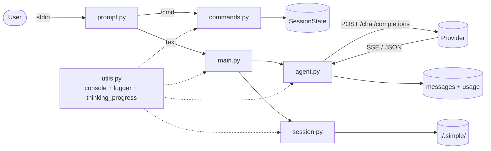
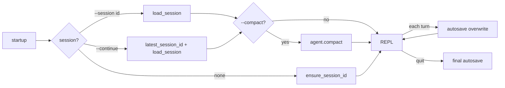

# simple -- raw chat harness

## 1. Scope

Minimal REPL over an OpenAI-compatible `/chat/completions` endpoint.
Single loop: `input -> system + history -> provider -> reply`. No
tools, no memory store, no agent framework. Intended as a reference
baseline for the `tooled` and `agentic` harnesses.

## 2. Non-goals

- Tool calling (no `tools` field in payload)
- Long-term memory (only in-session history)
- Hooks, policy, gating, multi-agent
- Validated structured output
- Remote tracing

## 3. Requirements

| Item                | Value                                                                                      |
| ------------------- | ------------------------------------------------------------------------------------------ |
| Runtime             | Python 3.12+                                                                               |
| Package manager     | `uv`                                                                                       |
| Provider            | Any OpenAI-compatible endpoint                                                             |
| Env vars (required) | `MODEL`, `BASE_URL`, `API_KEY`                                                             |
| Env vars (optional) | `CONNECT_TIMEOUT`, `READ_TIMEOUT`, `STREAM_READ_TIMEOUT` (`none` = unlimited), `LOG_LEVEL` |
| Deps runtime        | `httpx`, `rich>=15`, `rich-argparse`, `python-dotenv`, `netext` (diagram)                  |
| Deps stdlib         | `argparse`, `logging`, `readline`, `json`, `pathlib`, `dataclasses`, `typing`              |

No Pydantic at runtime. No agent framework.

## 4. Architecture



### 4.1 Session lifecycle



Session id persists across `load -> turns -> exit`. Autosave
overwrites `./.simple/sessions/<id>.json` per turn and on exit.

## 5. Components

| Module        | Responsibility                                                                             |
| ------------- | ------------------------------------------------------------------------------------------ |
| `agent.py`    | `Agent`, `AgentConfig`, `ChatResponse`, retry, compact/undo, models cache, `pop_last_user` |
| `commands.py` | Slash registry (`@register`); handlers take `(agent, state, arg)`                          |
| `prompt.py`   | Readline setup, ANSI-wrapped prompts, multi-line `\`, heredoc `<<<`, Tab completion        |
| `session.py`  | `SessionState`, autosave, transcript, export, `latest_session_id`                          |
| `main.py`     | Argparse, log level, REPL loop, streaming render                                           |
| `utils.py`    | `console` (Rich), `logger` (RichHandler), `thinking_progress` factory                      |
| `diagram.py`  | `netext` graphs: module flow + session lifecycle (CLI + `/diagram`)                        |

## 6. Features

### 6.1 Chat

- `Agent.chat` -- one-shot
- `Agent.chat_stream` -- SSE, callbacks for content and reasoning deltas
- `reasoning_effort` in `low | medium | high`; reasoning field
  normalized across providers (`reasoning_content` + `reasoning`)

### 6.2 Retry

- 3 attempts on `5xx` and `429`
- Honors `Retry-After` header; exponential backoff fallback
- Per-request timeouts: connect, read, stream-read (stream default unlimited)

### 6.3 History and compact

- `list[ChatMessage]` in memory
- `/compact [N]` -- summarize old messages, keep last N
- `/compact undo` -- restore pre-compact snapshot

### 6.4 Session persistence

- `./.simple/sessions/<id>.json` -- full state (model, params, messages, usage, created_at, updated_at)
- Autosave per turn + on exit, same id reused across resume
- `--session <id>` resume by id; `-c/--continue` resume most recent
- `-c --compact` resume then compact

### 6.5 REPL UX

- Rich prompts use ANSI with `\x01...\x02` zero-width markers (readline-safe)
- Tab completion via stdlib `readline`; detects `libedit` vs GNU
- Slash commands; arguments completed from dynamic sources
  (`/session`, `/thinking`, `/set`, `/compact`, `/model`)
- Multi-line input:
  1. Backslash continuation (`line\`)
  2. Heredoc (`<<<` or `<<< TAG`)
  3. Paste and Enter
- Spinner + elapsed timer (`rich.progress.Progress`, transient) for
  "Thinking..." and "Compacting..."
- Destructive commands gated by `rich.prompt.Confirm` (`/clear`, `/session reset`)

### 6.6 Transcript and export

- `./.simple/transcript.jsonl` -- append-only turn log (`session_id`, `model`, `tokens`, `response_time`)
- `/export [path]` -- markdown dump of conversation

### 6.7 Architecture diagrams

- `netext` + `networkx` render module flow (left-right) and session
  lifecycle (top-down) in the terminal
- Sugiyama layout, orthogonal routing, rounded box nodes, multi-line
  labels, dashed dim edges for shared-utility wiring
- `simple --diagram [flow|lifecycle]` (no arg = both) or `/diagram`
  from the REPL

## 7. CLI

```bash
simple                              # new session
simple -c                           # resume most recent
simple -c --compact                 # resume + compact
simple --session <id>               # resume by id
simple --model <id>                 # override model
simple --instructions "<text>"      # extra system instructions
simple --no-stream                  # disable streaming default
simple --log-level DEBUG            # HTTP + turn debug
simple --diagram [flow|lifecycle]   # render architecture (default: both)
```

## 8. Slash commands

| Command                              | Behavior                                           |
| ------------------------------------ | -------------------------------------------------- |
| `/help`                              | list commands                                      |
| `/stream`                            | toggle streaming                                   |
| `/thinking [low\|medium\|high\|off]` | show or set `reasoning_effort`                     |
| `/usage`                             | session token usage                                |
| `/clear`                             | clear in-memory history (confirm)                  |
| `/session [<id>\|reset]`             | list, load, or delete all (confirm)                |
| `/set <key> [value]`                 | set chat param (unset if value omitted)            |
| `/params`                            | show current params                                |
| `/model [<id>]`                      | list models (60s cache) or switch                  |
| `/instructions [<text>]`             | show or set system instructions                    |
| `/compact [<keep>\|undo]`            | summarize keeping last N; undo last compact        |
| `/retry`                             | drop last assistant reply, re-run last user turn   |
| `/edit`                              | drop last assistant reply, re-edit last user input |
| `/history [N]`                       | show last N messages                               |
| `/export [path]`                     | export conversation as markdown                    |
| `/diagram [flow\|lifecycle]`         | render netext architecture diagram (default: both) |
| `/quit`, `/exit`                     | leave (autosaves)                                  |

## 9. Storage

| Path                           | Purpose                         |
| ------------------------------ | ------------------------------- |
| `./.simple/sessions/<id>.json` | session (id stable across runs) |
| `./.simple/transcript.jsonl`   | turn log with tokens            |
| `./.simple/exports/<id>.md`    | markdown export                 |
| `./.simple/history`            | readline prompt history         |

Scoped to the directory where `simple` runs. Add `.simple/` to
`.gitignore`.

## 10. Provider gotchas

- **Ollama**: older builds reject `stream_options.include_usage`; stream works, usage reads zero.
- **Mistral (magistral-\*)**: reasoning in `reasoning_content`.
- **xAI (grok-\*-reasoning)**: reasoning in `reasoning`. `_extract_reasoning` covers both.
- **`/v1/models`**: shape varies per provider; 60s cache avoids spam.
- **429**: retry honors `Retry-After`; falls back to exponential backoff.

## 11. Dev checklist

```bash
uv run task lint      # ruff check --fix && ty check src
uv run task fmt       # ruff format
uv run task test      # pytest
uv run simple --help  # CLI args
```

## 12. In-scope roadmap

- Separate retry budgets (5xx vs 429)
- Clean stream cancel mid-flight (`client.stream` abort)
- `/diff` -- show param / instruction drift
- Bracketed paste detection
- Per-model pricing estimate (optional table)
- Auto-compact threshold warning

## 13. Out of scope (migrate to `tooled`)

- Tool calling
- Long memory
- Hooks, policy
- Structured output
- Multi-agent
