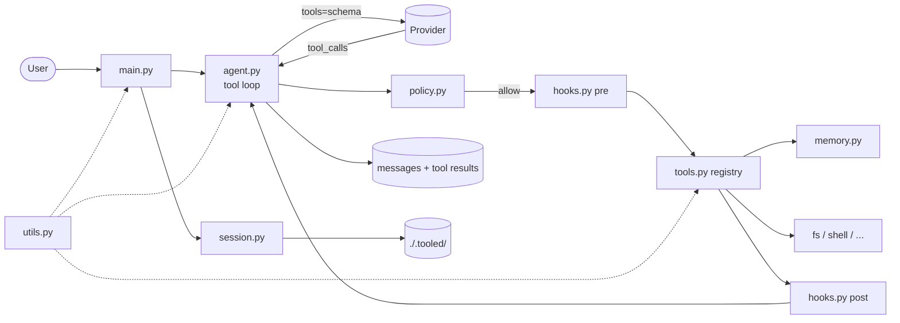

# tooled -- tool-calling harness

## 1. Scope

Extends `simple` with a real agent loop: model may emit tool calls,
harness executes them, appends results, continues until a plain
reply. Adds a minimal hook + policy layer and a separate memory
store. No agent framework -- same raw stack as `simple`.

Loop:

```text
user -> model -> (tool_calls?) -> [policy -> pre -> tool -> post] -> model -> ... -> reply
```

Iterate while `finish_reason == "tool_calls"`; each cycle appends a
`role=tool` message and re-invokes the model.

## 2. Non-goals

- Validated structured output (replies are strings / markdown)
- First-class multi-agent (possible via a tool that calls another agent, but manual)
- Parallel tool execution (serialized)
- Remote tracing (local logging only)

## 3. Requirements

| Item                | Value                                                                         |
| ------------------- | ----------------------------------------------------------------------------- |
| Runtime             | Python 3.12+                                                                  |
| Package manager     | `uv`                                                                          |
| Provider            | Must support tool calling (OpenAI, Mistral, compatibles, tool-capable Ollama) |
| Env vars (required) | Same as `simple`                                                              |
| Deps runtime        | `httpx`, `rich>=15`, `python-dotenv`                                          |
| Deps optional       | `pydantic` (schema generation only, not runtime framework)                    |
| Deps stdlib         | Same as `simple`                                                              |

## 4. Architecture

Same shape as `simple`; new modules in bold.



## 5. Components

| Module        | Responsibility                                                        |
| ------------- | --------------------------------------------------------------------- |
| `agent.py`    | Tool loop, `chat`/`chat_stream`, retry (same as `simple`)             |
| `tools.py`    | `@tool` registry, schema generation, dispatch                         |
| `hooks.py`    | `on_pre` / `on_post` callback lists                                   |
| `policy.py`   | `Policy` dataclass + confirm prompt, persistence                      |
| `memory.py`   | JSONL store + `remember` / `recall` tools                             |
| `session.py`  | Autosave, transcript, export (mirrors `simple`)                       |
| `commands.py` | Slash registry; adds `/tools`, `/memory`, `/policy`, `/hooks`         |
| `prompt.py`   | Same readline + ANSI prompts + Tab completion as `simple`             |
| `main.py`     | Argparse, REPL, streaming render                                      |
| `utils.py`    | `console`, `logger`, `thinking_progress` (reused from `simple`)       |

## 6. Features

### 6.1 Tools

Declarative registry with decorator:

```python
@tool(name="read_file", desc="Read a file")
def read_file(path: str) -> str: ...
```

- JSON schema generated from type hints + docstring
  (or a Pydantic `TypeAdapter` if the tool imports Pydantic)
- `tools_schema()` builds the request payload
- `dispatch_tool(name, args_json)` runs the tool and returns a string
- Starter catalog: `read_file`, `write_file`, `glob`, `grep`,
  `shell`, `remember`, `recall` (pick per use case)

### 6.2 Hooks

Two lists: `_PRE` and `_POST`.

```python
on_pre(lambda call: logger.info(f"calling {call.name}"))
on_post(lambda call, out: metrics.record(call, len(out)))
```

Use cases:

- structured log per tool
- metrics / timing
- secret redaction on output
- auto-compact when tokens exceed a threshold

### 6.3 Policy

Gating by tool name:

```python
Policy(
    allow={"read_file", "grep", "recall"},
    confirm={"write_file", "shell"},
    deny={"rm_rf"},
)
```

- `allow` -- run immediately
- `confirm` -- `rich.prompt.Confirm` before executing
- `deny` -- always refuse
- Editable at runtime via `/policy allow <tool>`; persisted to
  `./.tooled/policy.json`

### 6.4 Memory

Separate from chat history.

- History = conversation messages
- Memory = long-lived facts, session-independent
- Storage: JSONL append at `./.tooled/memory.jsonl`
  (upgrade path: SQLite FTS or embeddings)
- Exposed as tools `remember(text, tags)` and `recall(query, k)`
- REPL: `/memory list|recall|clear|add`

### 6.5 History

Same as `simple` plus interleaved `role=tool` messages. Compact
keeps `assistant(tool_calls) -> tool results` pairs together; never
splits them.

### 6.6 New slash commands

- `/tools` -- list; enable / disable by name
- `/memory [recall|list|clear|add]`
- `/policy [show|allow|confirm|deny] <tool>`
- `/hooks` -- list active hooks (debug)

Inherits everything else from `simple`.

## 7. Storage

| Path                           | Purpose                        |
| ------------------------------ | ------------------------------ |
| `./.tooled/sessions/<id>.json` | session (same shape as simple) |
| `./.tooled/memory.jsonl`       | memory store (append-only)     |
| `./.tooled/policy.json`        | persisted policy               |
| `./.tooled/transcript.jsonl`   | turn log incl. tool calls      |
| `./.tooled/exports/<id>.md`    | markdown export                |
| `./.tooled/history`            | readline prompt history        |

Add `.tooled/` to `.gitignore`.

## 8. When to use

- Comfortable with `simple` and want to understand the tool loop at the raw level
- Need 3-8 simple tools (filesystem, shell, memory)
- Want full control over payload, retry, schema
- No framework dependency acceptable

## 9. Limits

- Hand-written schema scales poorly past ~10 tools with nested types
- No `RunContext` -- deps passed via closures / globals
- Per-tool error handling is scattered
- Migration to multi-agent requires refactor

## 10. Effort estimate

400-600 new lines on top of `simple`. Two to three focused days.

## 11. Migration trigger (to `agentic`)

- Need **structured output** (Pydantic reply model)
- Need **multi-agent** (agent as a tool)
- Tool catalog passes ~10 with nested types
- Want pluggable **tracing**
