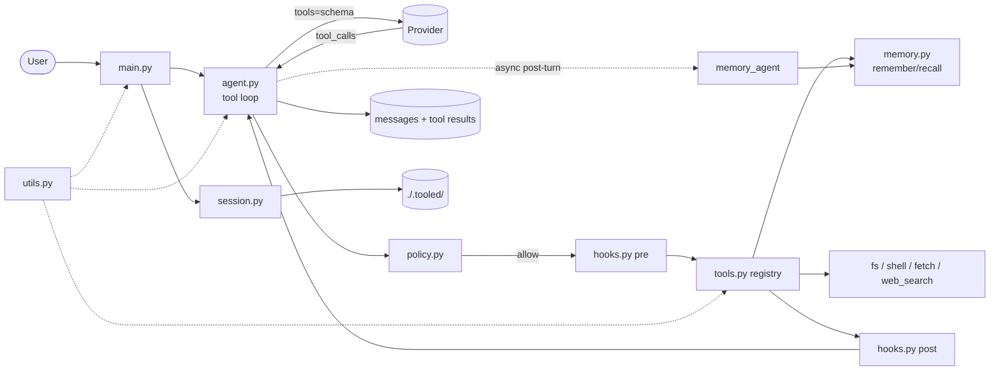

# tooled -- tool-calling harness

## 1. Scope

Extends `simple` with a real agent loop: model may emit tool calls,
harness executes them, appends results, continues until a plain
reply. Adds a minimal hook + policy layer and a separate memory
store. No agent framework -- same raw stack as `simple`.

Loop:

```text
user -> model -> (tool_calls?) -> [policy -> pre -> tool* -> post] -> model -> ... -> reply
```

`*` parallel when model emits multiple calls. Iterate while
`finish_reason == "tool_calls"`; each cycle appends `role=tool`
messages and re-invokes the model. Stack is fully async
(`asyncio` + `httpx.AsyncClient`).

## 2. Non-goals

- Remote tracing (local logging only)

## 3. Requirements

| Item                | Value                                                                         |
| ------------------- | ----------------------------------------------------------------------------- |
| Runtime             | Python 3.12+                                                                  |
| Package manager     | `uv`                                                                          |
| Provider            | Must support tool calling (OpenAI, Mistral, compatibles, tool-capable Ollama) |
| Env vars (required) | Same as `simple`                                                              |
| Deps runtime        | `httpx`, `rich>=15`, `python-dotenv`, `pydantic>=2`                           |
| Deps stdlib         | Same as `simple`                                                              |

## 4. Architecture

Same shape as `simple`; new modules in bold.



## 5. Components

| Module        | Responsibility                                                         |
| ------------- | ---------------------------------------------------------------------- |
| `agent.py`    | Async tool loop, `async chat`/`chat_stream`, required `response_model` |
| `tools/`      | `@tool` registry, schema gen, dispatch + catalog (fs/shell/fetch/web)  |
| `hooks.py`    | `@hook("pre"/"post")` decorator registry, `ToolCall` Pydantic model    |
| `policy.py`   | `Policy` Pydantic model, `gate()`, `ToolDenied`, persistence           |
| `memory.py`   | 3-tier memory (session/md/jsonl), memory agent, `remember`/`recall`    |
| `session.py`  | Autosave, transcript, export (mirrors `simple`)                        |
| `commands.py` | Slash registry; adds `/tools`, `/memory`, `/policy`, `/hooks`          |
| `prompt.py`   | Same readline + ANSI prompts + Tab completion as `simple`              |
| `main.py`     | Argparse, REPL, streaming render                                       |
| `utils.py`    | `console`, `logger`, `thinking_progress` (reused from `simple`)        |

## 6. Features

### 6.1 Tools

Declarative registry with decorator:

```python
@tool(name="read_file", desc="Read a file")
def read_file(path: str) -> str: ...
```

- JSON schema generated via Pydantic `TypeAdapter` from type hints;
  `BaseModel` args supported for complex / nested inputs
- `tools_schema()` builds the request payload
- `dispatch_tool(name, args_json)` validates args via `TypeAdapter`,
  then runs the tool and returns a string

**Catalog** (all in `tools/` subpackage, registered on import):

| Tool            | Sig                                              | Policy default | Notes                                    |
| --------------- | ------------------------------------------------ | -------------- | ---------------------------------------- |
| `read_file`     | `(path: str) -> str`                             | allow          | reads text, truncates at 100 KB          |
| `write_file`    | `(path: str, content: str) -> str`               | confirm        | creates parents; returns bytes written   |
| `list_dir`      | `(path: str, pattern: str = "*") -> str`         | allow          | glob, returns newline-separated paths    |
| `grep`          | `(pattern: str, path: str) -> str`               | allow          | ripgrep-style; returns matching lines    |
| `shell`         | `(cmd: str, timeout: float = 30.0) -> str`       | confirm        | `asyncio.create_subprocess_shell`        |
| `fetch`         | `(url: str, method: str = "GET") -> str`         | confirm        | `httpx.AsyncClient`; returns body text   |
| `web_search`    | `(query: str, k: int = 5) -> str`                | allow          | DuckDuckGo HTML scrape, no API key       |
| `remember`      | `(text: str, tags: list[str], tier: str) -> str` | allow          | save to memory tier                      |
| `recall`        | `(query: str, k: int = 5) -> str`                | allow          | search medium + long memory              |

- **Error strategy**: exceptions caught per-tool; error string returned
  as `role=tool` content so the model can recover or report; logged via
  `logger.exception`
- **Timeout**: `asyncio.wait_for(dispatch_tool(call), timeout=tool.timeout)`
  where `@tool(..., timeout=30.0)` sets per-tool limit; default `None`
  (no limit)

### 6.2 Hooks

Decorator registry mirroring `@tool`:

```python
@hook("pre")
def log_call(call: ToolCall) -> None:
    logger.info(f"calling {call.name} args={call.args}")

@hook("post")
def redact_secrets(call: ToolCall, out: str) -> str:
    return out.replace(SECRET, "***")

# optional: scope to a specific tool
@hook("pre", tool="shell")
def confirm_shell(call: ToolCall) -> None:
    if not Confirm.ask(f"Run: {call.args['cmd']}"): raise ToolDenied
```

- `ToolCall(id, name, args)` is a Pydantic model -- args validated against
  tool schema before hooks or dispatch run
- `@hook("pre")` -- runs before dispatch; may raise `ToolDenied` to abort
- `@hook("post")` -- runs after dispatch; may return modified output string
- optional `tool=` narrows scope to a single tool name
- registry is a list per phase; hooks run in definition order
- `hooks_list()` returns registered hooks for `/hooks` command

Use cases:

- structured log per tool call
- metrics / timing
- secret redaction on output
- auto-compact when tokens exceed a threshold

### 6.3 Policy

Pydantic model -- schema validated, serializes directly to/from
`./.tooled/policy.json`:

```python
class Policy(BaseModel):
    allow:   set[str] = Field(default_factory=set)
    confirm: set[str] = Field(default_factory=set)
    deny:    set[str] = Field(default_factory=set)

    model_config = ConfigDict(frozen=True)

    def gate(self, name: str) -> Literal["allow", "confirm", "deny"]:
        if name in self.deny:    return "deny"
        if name in self.confirm: return "confirm"
        if name in self.allow:   return "allow"
        return "confirm"  # unknown tools require confirmation by default
```

Gate enforced before every dispatch -- tool is blocked until verdict
resolves:

```python
async def dispatch_with_policy(call: ToolCall, policy: Policy) -> str:
    match policy.gate(call.name):
        case "deny":
            raise ToolDenied(call.name)
        case "confirm":
            if not await ask_confirm(call):
                raise ToolDenied(call.name)
    return await dispatch_tool(call)
```

- `allow` -- run immediately
- `confirm` -- `rich.prompt.Confirm` blocks until user approves or rejects
- `deny` -- always refuse, never prompts
- Unknown tool names default to `confirm` (safe default)
- Editable at runtime via `/policy allow|confirm|deny <tool>`; persisted
  to `./.tooled/policy.json` via `model.model_dump_json()`

### 6.4 Memory

Three tiers, each with different lifetime and storage:

| Tier        | What                                   | Storage                              |
| ----------- | -------------------------------------- | ------------------------------------ |
| Short-term  | Current conversation messages          | session JSON (in-memory)             |
| Medium-term | Accumulated facts and observations     | `./.tooled/memory.md`                |
| Long-term   | Definitions, rules, agent-judged rules | `./.tooled/memory_long.jsonl`        |

**Promotion**: after each turn a lightweight memory agent evaluates
the conversation and decides what, if anything, to persist:

```text
turn completes -> memory_agent(turn) -> {save, tier, content} -> write
```

The memory agent runs async after the main reply, non-blocking. It
uses a small focused prompt ("given this turn, should anything be
saved to medium or long-term memory?") and returns a structured
response (`response_model=MemoryDecision`):

```python
class MemoryDecision(BaseModel):
    save: bool
    tier: Literal["medium", "long"] | None = None
    content: str | None = None
    tags: list[str] = Field(default_factory=list)
```

**Medium-term** (`.md`): append-only markdown. Facts, preferences,
observations that are relevant across sessions but may change.
Example: "User prefers British English" or "Project uses uv, not pip".

**Long-term** (JSONL): stable definitions, rules, invariants the
agent judges worth preserving indefinitely. Append-only;
each line `{"id", "content", "tags", "created_at"}`.
Upgrade path: SQLite FTS5.

**Tools** (callable by model):

- `remember(text, tags, tier="medium")` -- explicit save to a tier
- `recall(query, k=5, tier="all")` -- FTS search across medium + long
- `forget(id)` -- delete by id (long-term only)

**REPL**: `/memory [list|recall <query>|clear|add <text>]`

### 6.5 History

Same as `simple` plus interleaved `role=tool` messages. Compact
keeps `assistant(tool_calls) -> tool results` pairs together; never
splits them.

### 6.6 New slash commands

- `/tools` -- list; enable / disable by name
- `/memory [list|recall <query>|clear|add <text>]`
- `/policy [show|allow|confirm|deny] <tool>`
- `/hooks` -- list active hooks (debug)

Inherits everything else from `simple`.

### 6.7 Parallel tool execution

Stack is fully async (`asyncio` + `httpx.AsyncClient`). When the model
returns multiple `tool_calls`, dispatch concurrently:

```python
results = await asyncio.gather(*[dispatch_tool(tc) for tc in tool_calls])
```

- `agent.py` uses `httpx.AsyncClient`; `chat` / `chat_stream` are `async def`
- `main.py` runs under `asyncio.run(main())`
- Tools are `async def` where IO-bound; sync tools wrapped with
  `asyncio.to_thread`
- Pre/post hooks are `async def`; awaited per-tool before/after dispatch
- Policy `confirm` tools serialized (rich prompt not concurrent-safe);
  run after parallel batch completes
- Consequence: whole stack is async -- `commands.py`, `session.py`,
  `hooks.py` all gain `async def` where needed
- **Max iterations**: `Agent(config, max_tool_iterations=10)` -- loop
  aborts with a user-visible warning if the model keeps calling tools
  beyond the limit; prevents infinite loops

### 6.8 Structured output

`response_model: type[BaseModel]` is a required field on `Agent` --
every agent always returns validated structured output. Plain text
replies use the built-in `Reply` base:

```python
class Reply(BaseModel):
    content: str  # default: plain assistant reply

class Summary(BaseModel):
    title: str
    points: list[str]

agent = Agent(config, response_model=Summary)
resp = await agent.chat("summarize this")
print(resp.parsed.title)   # Summary instance
print(resp.content)        # raw JSON string
```

- Always adds `response_format: {"type": "json_schema", ...}` to request
- Validates reply with `TypeAdapter(response_model).validate_json(content)`
- `ChatResponse.parsed` holds the validated model instance
- `ChatResponse.content` retains the raw JSON string for logging

### 6.9 Multi-agent

First-class `@tool` helper that spawns a sub-agent with its own history:

```python
@tool(name="delegate", desc="Run a sub-task with a fresh agent")
async def delegate(instructions: str) -> str:
    sub = Agent(config)
    resp = await sub.chat(instructions)
    return resp.content
```

- Sub-agent shares `AgentConfig` (model, provider) but isolated history
- Returns string result to parent; parent appends as `role=tool` message
- No automatic state sharing -- parent must pass context in `instructions`
- `/tools` command shows `delegate` like any other tool

## 7. Storage

| Path                           | Purpose                              |
| ------------------------------ | ------------------------------------ |
| `./.tooled/sessions/<id>.json` | session (same shape as simple)       |
| `./.tooled/memory.md`          | medium-term memory (facts/obs)       |
| `./.tooled/memory_long.jsonl`  | long-term memory (rules/definitions) |
| `./.tooled/policy.json`        | persisted policy                     |
| `./.tooled/transcript.jsonl`   | turn log incl. tool calls            |
| `./.tooled/exports/<id>.md`    | markdown export                      |
| `./.tooled/history`            | readline prompt history              |

Add `.tooled/` to `.gitignore`.

## 8. When to use

- Comfortable with `simple` and want to understand the tool loop at the raw level
- Need 3-8 simple tools (filesystem, shell, memory)
- Want full control over payload, retry, schema
- No framework dependency acceptable

## 9. Limits

- Hand-written schema scales poorly past ~10 tools with nested types
- No `RunContext` -- deps injected via `contextvars.ContextVar`; set
  once per turn in `agent.py`, readable in any tool without passing
  explicitly:

  ```python
  _agent_ctx: ContextVar[Agent] = ContextVar("agent_ctx")
  # in agent.py before dispatch:
  token = _agent_ctx.set(self)
  # in any tool:
  agent = _agent_ctx.get()
  ```

- Per-tool error handling is scattered
- Sync tools require `asyncio.to_thread` wrapper
- Async stack makes interactive debugging harder (longer tracebacks)

## 10. Effort estimate

700-1000 new lines on top of `simple`. Four to six focused days (async
stack adds non-trivial refactor from `simple`).

## 11. Migration trigger (to `agentic`)

- Tool catalog passes ~10 with nested types and deep nesting
- Need **orchestrated multi-agent** (routing, shared state, agent-to-agent messaging)
- Want pluggable **tracing** (OpenTelemetry, LangSmith, etc.)
- Need **RunContext** / dependency injection across tools
